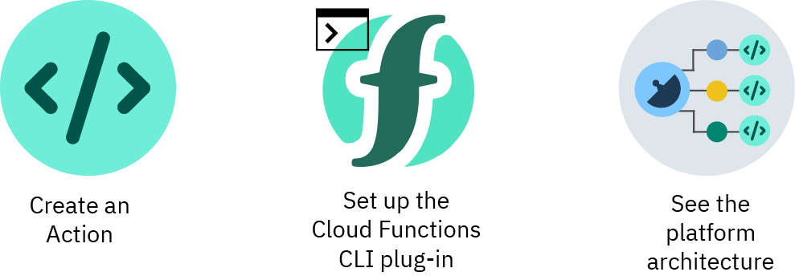

---

copyright:
  years: 2017, 2019
lastupdated: "2019-06-26"

keywords: functions, ibm cloud functions, cloud functions, getting started, creating actions

subcollection: cloud-functions

---

{:new_window: target="_blank"}
{:shortdesc: .shortdesc}
{:screen: .screen}
{:pre: .pre}
{:table: .aria-labeledby="caption"}
{:codeblock: .codeblock}
{:tip: .tip}
{:note: .note}
{:important: .important}
{:deprecated: .deprecated}
{:download: .download}
{:gif: data-image-type='gif'}


# Getting started with {{site.data.keyword.openwhisk}}
{: #getting-started}

With {{site.data.keyword.openwhisk}} you can use your favorite programming language to write lightweight code that runs app logic in a scalable way. You can run code on-demand with HTTP-based API requests from applications or run code in response to {{site.data.keyword.cloud_notm}} services and third-party events. The Function-as-a-Service (Faas) programming platform is based on the open source project Apache OpenWhisk.
{: shortdesc}

## Working with actions
{: #gs_actions}

With {{site.data.keyword.openwhisk}}, you can create stateless code snippets that are set to perform one specific task that is called an action. To learn more about actions and other Functions terms, see [terminology](/docs/openwhisk?topic=cloud-functions-about).
{:shortdesc}

Click an option to get started.


<map name="home_map" id="home_map">
<area href="#gs_hello_world" alt="Create an action" title="Create an action" shape="rect" coords="-7, -8, 108, 211" />
<area href="/docs/openwhisk?topic=cloud-functions-cli_install" alt="Set up the {{site.data.keyword.openwhisk_short}} CLI plug-in" title="Set up the {{site.data.keyword.openwhisk_short}} CLI plug-in" shape="rect" coords="155, -1, 289, 210" />
<area href="/docs/openwhisk?topic=cloud-functions-about" alt="See the platform architecture" title="See the platform architecture" shape="rect" coords="326, -10, 448, 218" />
</map>

## Creating an action in the GUI
{: #gs_hello_world}

To get started with {{site.data.keyword.openwhisk_short}}, try creating the Hello World quickstart template.

1. Create an [{{site.data.keyword.cloud_notm}}](https://cloud.ibm.com/registration) account or log in to an existing account.

2. Navigate to the [{{site.data.keyword.openwhisk_short}} dashboard ](https://cloud.ibm.com/openwhisk).

2. Click **Start Creating** > **Quickstart Templates** and select the **Hello World** template.

3. Create a package for your actions by inputting a unique name in the **Package Name** field.

4. Select a runtime from the drop-down menu in the **Action helloworld** section. You can preview the code for the sample action in each available runtime before you deploy the template.

5. Click **Deploy**. You created an action. Great job!

6. Run the action by clicking **Invoke**. Invoking an action manually runs the app logic that the action defines. In the **Activations** panel, you can see the "Hello stranger!" greeting produced by the action.

7. Optional: Click **Change Input** to change the action or try your own.

  a. Paste the following code into the **Change Input** box and change the name value.
  ```
  { "name": "xxxx" }
  ```
  {: codeblock}
  b. Then, click **Invoke** to run the action with your updates. The result is shown in the **Activations** panel. You can repeat this process as many times as you like.

Good work! You created your first action. To clean up this action, click the overflow menu and select **Delete Action**.

## Creating an action in the CLI
{: #gs_hello_world_cli}

Get up and running quickly with the [Hello World JavaScript](/docs/openwhisk?topic=cloud-functions-prep#prep-js) example code. This example creates a basic `hello` action, which you can manually invoke to run its app logic.

## What's next?
{: #gs_next_steps}

So you completed your first template deployment, where do you go from here?

* Become familiar with the [terminology](/docs/openwhisk?topic=cloud-functions-about#about_technology).
* Get started with [your own actions](/docs/openwhisk?topic=cloud-functions-actions).
* Learn about organizing actions in [packages](/docs/openwhisk?topic=cloud-functions-pkg_ov).
* Advanced option - Create a [serverless REST API](/docs/openwhisk?topic=cloud-functions-apigateway).
