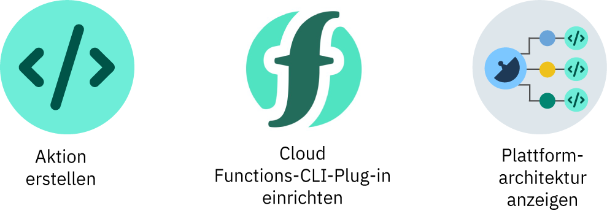

---

copyright:
  years: 2016, 2018
lastupdated: "2018-06-21"

---

{:shortdesc: .shortdesc}
{:codeblock: .codeblock}
{:screen: .screen}
{:pre: .pre}

# Einführung
{: #index}

{{site.data.keyword.openwhisk}} ist eine in verschiedenen Sprachen verfügbare FaaS-Programmierungsplattform (FaaS = Functions-as-a-Service) auf der Basis von Apache OpenWhisk. {{site.data.keyword.openwhisk_short}} ermöglicht es Entwicklern, einfachen Code (sogenannte "Aktionen") zu schreiben, die die App-Logik skalierbar ausführen. Sie können die Aktionen so einrichten, dass sie bedarfsgerecht auf der Basis von HTTP-basierten API-Anforderungen von Web-Apps oder mobilen Apps oder automatisch als Reaktion auf ereignisgesteuerte Anforderungen von {{site.data.keyword.Bluemix_notm}}-Services und Ereignissen von Drittanbietern ausgeführt werden.
{: shortdesc}

Da {{site.data.keyword.openwhisk_short}} eine serverunabhängige, ereignisgesteuerte Plattform ist, müssen Sie keine Server explizit bereitstellen. Entwickler, die mit Mikroservices, mobilen Apps, IoT-Apps und vielen anderen Apps arbeiten, können sich auf das Schreiben der App-Logik konzentrieren, ohne sich um automatische Skalierung, hohe Verfügbarkeit, Aktualisierungen und Wartung kümmern zu müssen. Sie erhalten sofort nutzbare Auto-Scaling- und Lastverteilungsfunktionen, ohne Cluster, Lastverteilungsfunktionen, HTTP-Plug-ins usw. manuell konfigurieren zu müssen. Sämtliche Hardware, Netzfunktionalität und Software wird von IBM gewartet. Sie müssen nur noch den Code bereitstellen.

Klicken Sie als ersten Schritt auf eine Option:


<map name="home_map" id="home_map">
<area href="#openwhisk_start_hello_world" alt="Aktion erstellen" title="Aktion erstellen" shape="rect" coords="-7, -8, 108, 211" />
<area href="bluemix_cli.html" alt="Die {{site.data.keyword.openwhisk_short}}-CLI-Plug-in einrichten" title="Die {{site.data.keyword.openwhisk_short}}-CLI-Plug-in einrichten" shape="rect" coords="155, -1, 289, 210" />
<area href="openwhisk_about.html" alt="Plattformarchitektur anzeigen" title="Plattformarchitektur anzeigen" shape="rect" coords="326, -10, 448, 218" />
</map>


## Aktion in der Benutzerschnittstelle erstellen
{: #openwhisk_start_hello_world}

Für den Einstieg in {{site.data.keyword.openwhisk_short}} können Sie die HelloWorld-Quickstart-Vorlage verwenden.

1.  Klicken Sie in der Kategorie **Funktionen** im [{{site.data.keyword.Bluemix_notm}} **Katalog** ](https://console.bluemix.net/catalog/?category=whisk) auf "Funktionen".

2. Klicken Sie auf **Erstellung starten** > **Quickstart-Vorlagen** und wählen Sie die Vorlage **Hello World** aus.

5. Verwenden Sie den Code für die Aktion und erstellen Sie die Aktion, indem Sie auf **Bereitstellen** klicken. Sie verfügen jetzt über eine Aktion mit dem Namen `hello`.

6. Führen Sie die Aktion aus, indem Sie auf **Aufrufen** klicken. Wenn Sie eine Aktion aufrufen, wird die App-Logik, die die Aktion definiert, manuell ausgeführt. In der Anzeige **Aktivierungen** sehen den Text "Hello stranger!", der von der Aktion generiert wurde.

Gute Arbeit! Sie haben Ihre erste Aktion erstellt. Um diese Aktion wieder zu entfernen, klicken Sie auf das Überlaufmenü und wählen Sie **Aktion löschen** aus.

## Aktion in der Befehlszeilenschnittstelle erstellen
{: #openwhisk_start_hello_world_cli}

Mit dem HelloWorld-JavaScript-Beispielcode können Sie Ihre Arbeit schon nach kürzester Zeit aufnehmen. In diesem Beispiel wird eine einfache Aktion `hello` erstellt, die Sie manuell aufrufen können, um die zugehörige App-Logik auszuführen.

1. [Richten Sie das {{site.data.keyword.openwhisk_short}}-CLI-Plug-in](bluemix_cli.html) ein.

2. Speichern Sie den folgenden Code in einer Datei mit dem Namen **hello.js**.

    ```javascript
    /**
     * Hello world as an OpenWhisk action.
     */
function main(params) {
        var name = params.name || 'World';
    return {payload:  'Hello, ' + name + '!'};
    }
    ```
    {: codeblock}

3. Erstellen Sie die Aktion `hello`.
```
    ibmcloud fn action create hello hello.js
    ```
    {: pre}

4. Rufen Sie die Aktion ohne Übergabe von Parametern auf.
    ```
    ibmcloud fn action invoke hello --blocking --result
    ```
    {: pre}  

    Ausgabe:
    ```
    {
        "payload": "Hello, World!"
    }
    ```
    {: screen}

5. Rufen Sie die Aktion nochmals auf und übergeben Sie den Namensparameter, um die App-Logik zu testen.
    ```
    ibmcloud fn action invoke hello --blocking --result --param name Fred
    ```
    {: pre}  

    Ausgabe:
    ```
    {
        "payload": "Hello, Fred!"
    }
    ```
    {: screen}

Gute Arbeit! Sie haben Ihre erste Aktion erstellt. Um diese Aktion wieder zu entfernen, führen Sie `ibmcloud fn action delete hello` aus.

**Weitere Schritte**
* [Beispiel für den Alarmservice verwenden, um die Aktion **hello** jedes Mal aufzurufen, wenn ein regelmäßiges Ereignis generiert wird.](./openwhisk_packages.html#openwhisk_package_trigger)
* [Serverunabhängige REST-API erstellen](openwhisk_apigateway.html)
* [Vorinstallierte Aktionspakete für {{site.data.keyword.Bluemix_notm}}-Services wie Cloudant verwenden](cloudant_actions.html)
