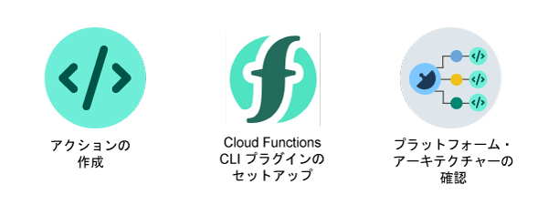

---

copyright:
  years: 2017, 2019
lastupdated: "2019-07-18"

keywords: functions, ibm cloud functions, cloud functions, getting started, creating actions

subcollection: cloud-functions

---

{:new_window: target="_blank"}
{:shortdesc: .shortdesc}
{:screen: .screen}
{:pre: .pre}
{:table: .aria-labeledby="caption"}
{:external: target="_blank" .external}
{:codeblock: .codeblock}
{:tip: .tip}
{:note: .note}
{:important: .important}
{:deprecated: .deprecated}
{:download: .download}
{:gif: data-image-type='gif'}


# IBM {{site.data.keyword.openwhisk_short}} 入門
{: #getting-started}

{{site.data.keyword.openwhisk}} では、任意のプログラミング言語を使用して、スケーラブルな方法で、アプリのロジックを実行する軽量のコードを作成することができます。アプリケーションからの HTTP ベースの API 要求によってオンデマンドでコードを実行したり、{{site.data.keyword.cloud_notm}} サービスやサード・パーティーのイベントへの応答としてコードを実行したりできます。この Function-as-a-Service (Faas) プログラミング・プラットフォームは、オープン・ソース・プロジェクトである Apache OpenWhisk を基盤としています。
{: shortdesc}

## アクションの操作
{: #gs_actions}

{{site.data.keyword.openwhisk}} を使用して、アクションと呼ばれる 1 つの特定のタスクを実行するように設定した、ステートレス・コード・スニペットを作成することができます。 アクションやその他の Functions の用語について詳しくは、[用語](/docs/openwhisk?topic=cloud-functions-about)を参照してください。
{:shortdesc}

いずれかのオプションをクリックして、開始します。


<map name="home_map" id="home_map">
<area href="#gs_hello_world" alt="アクションの作成" title="アクションの作成" shape="rect" coords="-7, -8, 108, 211" />
<area href="/docs/openwhisk?topic=cloud-functions-cli_install" alt="{{site.data.keyword.openwhisk_short}} CLI プラグインのセットアップ" title="{{site.data.keyword.openwhisk_short}} CLI プラグインのセットアップ" shape="rect" coords="155, -1, 289, 210" />
<area href="/docs/openwhisk?topic=cloud-functions-about" alt="プラットフォーム・アーキテクチャーの確認" title="プラットフォーム・アーキテクチャーの確認" shape="rect" coords="326, -10, 448, 218" />
</map>

## GUI でのアクションの作成
{: #gs_hello_world}

{{site.data.keyword.openwhisk_short}} の入門として、Hello World クイック・スタート・テンプレートを作成してみてください。

1. [{{site.data.keyword.cloud_notm}}](https://cloud.ibm.com/registration){: external} アカウントを作成するか、または既存のアカウントにログインします。

2. [{{site.data.keyword.openwhisk_short}} ダッシュボード](https://cloud.ibm.com/openwhisk){: external}に移動します。

2. **「作成の開始」**>**「クイック・スタート・テンプレート」**をクリックし、**「Hello World」**テンプレートを選択します。

3. **「パッケージ名」**フィールドに固有の名前を入力して、アクションのパッケージを作成します。

4. **「アクション helloworld (Action helloworld)」**セクションでドロップダウン・メニューからランタイムを選択します。 テンプレートをデプロイする前に、使用可能な各ランタイムでサンプル・アクションのコードをプレビューできます。

5. **「デプロイ」**をクリックします。 アクションの作成が終了しました。おつかれさまでした。

6. **「起動」**をクリックしてアクションを実行します。 アクションを手動で呼び出すと、アクションで定義されたアプリケーション・ロジックが実行されます。 **「アクティベーション (Activations)」**パネルに、アクションによって生成された「Hello stranger!」という挨拶が表示されます。

7. オプション:**「入力の変更」**をクリックして、アクションを変更するか、独自のアクションを試行します。

  a. 以下のコードを**「入力の変更」**ボックスに貼り付け、名前値を変更します。
  ```
  { "name": "xxxx" }
  ```
  {: codeblock}
  b. それから、**「起動」**をクリックして、更新したアクションを実行します。 **「アクティベーション」**パネルに結果が表示されます。 この処理を必要な回数だけ繰り返すことができます。

おつかれさまでした。 最初のアクションの作成が終了しました。 このアクションをクリーンアップするには、オーバーフロー・メニューをクリックし、**「アクションの削除」**を選択します。

## CLI でのアクションの作成
{: #gs_hello_world_cli}

[Hello World JavaScript](/docs/openwhisk?topic=cloud-functions-prep#prep-js) サンプル・コードを使用して、素早く稼働させることができます。この例では、基本的な `hello` アクションを作成します。このアクションを手動で呼び出して、アプリケーション・ロジックを実行できます。

## 次の作業
{: #gs_next_steps}

テンプレートの初回デプロイメントが完了しました。次の作業は何でしょうか? 

* [用語](/docs/openwhisk?topic=cloud-functions-about#about_technology)について理解します。
* [独自のアクション](/docs/openwhisk?topic=cloud-functions-actions)の使用を開始します。
* [パッケージ](/docs/openwhisk?topic=cloud-functions-pkg_ov)内のアクションの編成について学習します。
* 上級オプション - [サーバーレス REST API](/docs/openwhisk?topic=cloud-functions-apigateway) を作成します。


