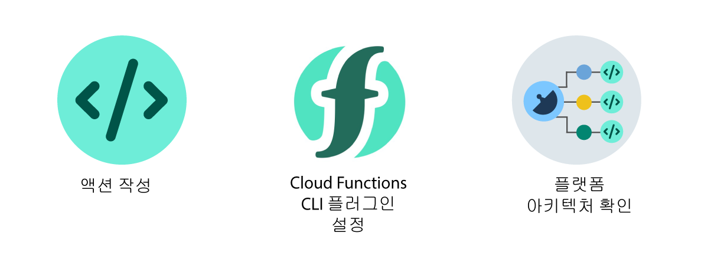

---

copyright:
  years: 2016, 2018
lastupdated: "2018-06-21"

---

{:shortdesc: .shortdesc}
{:codeblock: .codeblock}
{:screen: .screen}
{:pre: .pre}

# 시작하기
{: #index}

{{site.data.keyword.openwhisk}}는 Apache OpenWhisk를 기반으로 한 다중 언어 FaaS(Functions-as-a-Service) 프로그래밍 플랫폼입니다. {{site.data.keyword.openwhisk_short}}를 사용하면 개발자가 앱 로직을 확장 가능하게 실행하는 액션이라고 하는 간단한 코드를 작성할 수 있습니다. 웹 앱 또는 모바일 앱에서 HTTP 기반 API에 따라 요청 시 발생하거나 {{site.data.keyword.Bluemix_notm}} 서비스 및 써드파티 이벤트의 이벤트 기반 요청에 대한 응답으로 자동으로 발생하도록 액션을 설정할 수 있습니다.
{: shortdesc}

{{site.data.keyword.openwhisk_short}}는 서버리스, 이벤트 중심 플랫폼이므로 명시적으로 서버를 프로비저닝하지 않아도 됩니다. 마이크로서비스, 모바일, IoT 및 많은 다른 앱에 대한 작업을 수행하는 개발자는 Auto-Scaling, 고가용성, 업데이트 및 유지보수에 대해 걱정하는 대신 앱 로직 작성에 집중할 수 있습니다. 즉시 사용 가능한 Auto-Scaling 및 로드 밸런싱은 수동으로 클러스터, http 플러그인 등을 구성하지 않아도 됨을 의미합니다. IBM은 하드웨어, 네트워크 및 소프트웨어 관리를 모두 처리합니다. 여러분은 코드를 제공하기만 하면 됩니다.

시작하려면 옵션을 클릭하십시오.


<map name="home_map" id="home_map">
<area href="#openwhisk_start_hello_world" alt="액션 작성" title="액션 작성" shape="rect" coords="-7, -8, 108, 211" />
<area href="bluemix_cli.html" alt="{{site.data.keyword.openwhisk_short}} CLI 플러그인 설정" title="{{site.data.keyword.openwhisk_short}} CLI 플러그인 설정" shape="rect" coords="155, -1, 289, 210" />
<area href="openwhisk_about.html" alt="플랫폼 아키텍처 참조" title="플랫폼 아키텍처 참조" shape="rect" coords="326, -10, 448, 218" />
</map>


## GUI에서 액션 작성
{: #openwhisk_start_hello_world}

{{site.data.keyword.openwhisk_short}}를 시작하려면 HelloWorld 빠른 시작 템플리트 사용을 시도하십시오.

1.  [{{site.data.keyword.Bluemix_notm}} **카탈로그** ](https://console.bluemix.net/catalog/?category=whisk) **Functions** 카테고리에서 Functions를 클릭하십시오.

2. **작성 시작** > **빠른 시작 템플리트**를 클릭하고 **Hello World** 템플리트를 선택하십시오.

5. 액션에 대한 코드를 확인한 다음 **배치**를 클릭하여 액션을 작성하십시오. 이제 `hello`라고 하는 액션을 갖게 됩니다.

6. **호출**을 클릭하여 액션을 실행하십시오. 액션을 수동으로 호출하면 액션이 정의하는 앱 로직이 실행됩니다. **활성화** 패널에 액션으로 생성된 "Hello stranger!"라는 인사가 표시됩니다.

잘하셨습니다! 첫 번째 액션을 작성했습니다. 이 액션을 정리하려면 오버플로우 메뉴를 클릭하고 **액션 삭제**를 선택하십시오.

## CLI에서 액션 작성
{: #openwhisk_start_hello_world_cli}

HelloWorld JavaScript 예제 코드로 빠르게 시작하고 실행합니다. 이 예제에서는 해당 앱 로직을 실행하기 위해 수동으로 호출할 수 있는 기본 `hello` 액션을 작성합니다.

1. [{{site.data.keyword.openwhisk_short}} CLI 플러그인을 설정하십시오](bluemix_cli.html).

2. **hello.js** 파일에 다음 코드를 저장하십시오.

    ```javascript
    /**
     * Hello world as an OpenWhisk action.
     */
function main(params) {
        var name = params.name || 'World';
    return {payload:  'Hello, ' + name + '!'};
    }
    ```
    {: codeblock}

3. `hello` 액션을 작성하십시오.
    ```
    ibmcloud wsk action create hello hello.js
    ```
    {: pre}

4. 매개변수를 전달하지 않고 액션을 호출하십시오.
    ```
    ibmcloud wsk action invoke hello --blocking --result
    ```
    {: pre}  

    출력:
    ```
    {
        "payload": "Hello, World!"
    }
    ```
    {: screen}

5. 앱 로직을 테스트하려면 이름 매개변수를 전달하여 액션을 다시 호출하십시오.
    ```
    ibmcloud wsk action invoke hello --blocking --result --param name Fred
    ```
    {: pre}  

    출력:
    ```
    {
        "payload": "Hello, Fred!"
    }
    ```
    {: screen}

잘하셨습니다! 첫 번째 액션을 작성했습니다. 이 액션을 정리하려면 `ibmcloud wsk action delete hello`를 실행하십시오.

**다음에 수행할 작업**
* [주기적 이벤트를 생성할 때마다 **hello** 액션을 호출하도록 알람 서비스 예제를 시도하십시오.](./openwhisk_packages.html#openwhisk_package_trigger)
* [서버리스 REST API를 작성하십시오.](openwhisk_apigateway.html)
* [Cloudant와 같은 {{site.data.keyword.Bluemix_notm}} 서비스의 사전 설치된 액션 패키지를 확인하십시오.](cloudant_actions.html)
