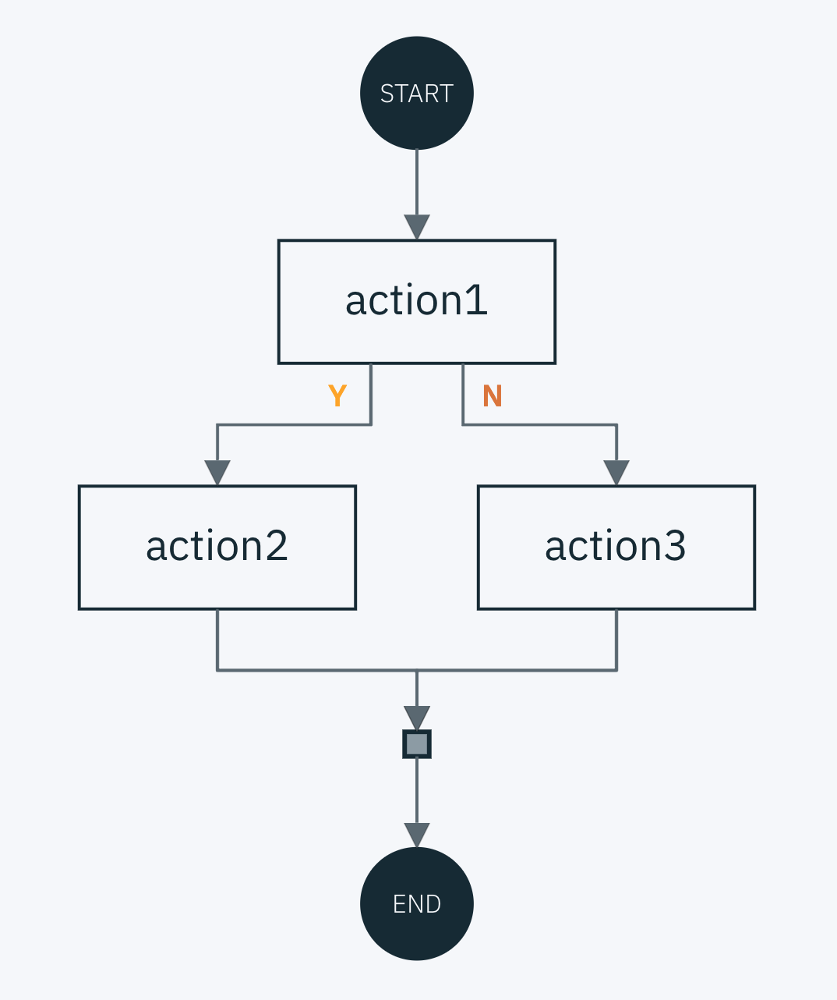

---

copyright:
  years: 2017, 2023
lastupdated: "2023-10-19"

keywords: composer, openwhisk, compositions, sequence, branch, functions, combinator, loops, actions

subcollection: openwhisk

---

{{site.data.keyword.attribute-definition-list}}

# Composer
{: #pkg_composer}

{{site.data.keyword.openwhisk}} is deprecated. As of 28 December 2023, you can't create new function instances, and access to free instances will be removed. Existing premium plan function instances are supported until October 2024. Any function instances that still exist on that date will be deleted. For more information, see [Deprecation overview](/docs/openwhisk?topic=openwhisk-dep-overview).
{: deprecated}

With Composer, {{site.data.keyword.openwhisk}} supports conductor actions, which extends sequences with more combinators ([JS](https://github.com/ibm-functions/composer/blob/master/docs/COMBINATORS.md){: external}, [Python](https://github.com/ibm-functions/composer-python/blob/master/docs/COMBINATORS.md){: external}) By using Composer, you can create more complex flows that include conditional branching, error handling, retries, and loops.

## Installing the Composer library for JavaScript or Python
{: #install_composer}

You can use Composer with actions that are written in any language, but you express the composition in either JavaScript or Python. After the installation, you can use the Composer `compose/pycompose` and `deploy/pydeploy` commands to [configure and run a composition](#run).
{: shortdesc}

### For JavaScript
{: #install_composer_js}

1. Install the Composer library [Node.js package](https://github.com/ibm-functions/composer){: external} by using the Node Package Manager.

    ```bash
    npm install -g @ibm-functions/composer
    ```
    {: pre}

2. Confirm that you installed the library by running help for the Composer commands.

    ```bash
    compose -h
    deploy -h
    ```
    {: codeblock}

    The following example shows possible output for the Composer commands.

    ```sh
    Usage:
        compose composition.js [flags]

    Usage:
        deploy composition composition.json [flags]
    ```
    {: screen}

### For Python
{: #install_composer_python}

Install the [Composer for Python](https://github.com/ibm-functions/composer-python){: external} library by using `pip3`.

1. Install the Composer library.

    ```bash
    pip3 install git+https://github.com/ibm-functions/composer-python.git
    ```
    {: pre}

2. Confirm that you installed the library by running help for the Composer commands.

    ```sh
    pycompose -h
    pydeploy -h
    ```
    {: codeblock}

    **Example output**

    ```sh
    usage: pycompose composition.py command [flags]

    usage: pydeploy composition composition.json [flags]
    ```
    {: screen}

## Configuring and running compositions in {{site.data.keyword.openwhisk_short}}
{: #run}

You can use the JavaScript or Python Composer libraries to create your compositions in {{site.data.keyword.openwhisk_short}}. Use `compose` or `pycompose` to compile your composition source code, then use `deploy` or `pydeploy` to deploy the composition to {{site.data.keyword.openwhisk_short}}. After you configure the composition, you can run it in {{site.data.keyword.openwhisk_short}}.
{: shortdesc}

Before you begin

1. Log in to {{site.data.keyword.cloud_notm}} and install the [IBM Cloud and the {{site.data.keyword.openwhisk_short}} CLI](/docs/openwhisk?topic=openwhisk-cli_install).
2. [Set up and target a namespace](/docs/openwhisk?topic=openwhisk-namespaces#create_iam_namespace).

To run a composition, follow these steps

1. Create Composer source code with the Node.js or Python libraries. You can find some example code in the samples folder of each repository ([JS](https://github.com/ibm-functions/composer/tree/master/samples){: external}, [Python](https://github.com/ibm-functions/composer-python/tree/master/samples){: external}).

2. Compile the Composer source code into a JSON file.

    - **JavaScript**

        ```javascript
        compose demo.js > demo.json
        ```
        {: pre}

    - **Python**

        ```python
        pycompose demo.py > demo.json
        ```
        {: pre}

3. Deploy the code to {{site.data.keyword.openwhisk_short}}. Include the `-w` flag to overwrite any existing deployment that is named `demo`.

    - **JavaScript**

        ```bash
        deploy demo demo.json -w
        ```
        {: pre}

    - **Python**

        ```bash
        pydeploy demo demo.json -w
        ```
        {: pre}

4. Execute the composition in the same way you [invoke other actions](/docs/openwhisk?topic=openwhisk-triggers) in {{site.data.keyword.openwhisk_short}}.

    ```sh
    ibmcloud fn action invoke demo
    ```
    {: pre}

{{site.data.keyword.openwhisk_short}} executes the code that you deployed as a special action. For more information, see the documentation on [conductor actions](https://github.com/apache/openwhisk/blob/master/docs/conductors.md){: external}.

## Extending sequences with Composer
{: #extending}

With Apache OpenWhisk, you can chain functions together in a `sequence`, where the output of one action becomes the input to another action.

### Sequences without Composer
{: #sequences-without-composer}

You can chain together two functions that are named `action1` and `action2` in  {{site.data.keyword.openwhisk_short}}:

```sh
ibmcloud fn action create --sequence mysequence action1 action2
```
{: pre}

The result of this command is a function that is called `mysequence`, which is a composite of `action1` and `action2`.  You can use `mysequence` in the same manner as any function in OpenWhisk.

### Sequences with Composer
{: #sequences-with-composer}

In Composer, you can specify richer sequences by using source code rather than the command line.

#### For JavaScript
{: #sequences-with-composer-js}

```javascript
const composer = require('@ibm-functions/composer')

module.exports = composer.seq('action1', 'action2')
```
{: codeblock}

#### For Python
{: #sequences-with-composer-python}

```python
import composer

def main():
    return composer.sequence('action1', 'action2')
```
{: codeblock}

{: caption="Figure 1. Sequence with two actions" caption-side="bottom"}

You aren't limited to chaining together functions in Composer. Composer includes a family of [JavaScript](https://github.com/ibm-functions/composer/blob/master/docs/COMBINATORS.md){: external} or [Python](https://github.com/ibm-functions/composer-python/blob/master/docs/COMBINATORS.md){: external} based combinators that enhance the expressiveness of sequences. You can see common examples in the following sections.

### Error handling for a sequence
{: #error-handling}

You can add error handling to a sequence by using `try-catch-finally` blocks. In this example, you surround the sequence with a try. The `handleError` code executes if either action returns an error.

#### For JavaScript
{: #error-handling-js}

```javascript
const composer = require('@ibm-functions/composer')

module.exports = composer.try(
    composer.seq('action1', 'action2'),
    'handleError')
```
{: codeblock}

#### For Python
{: #error-handling-python}

```python
import composer

def main():
    return composer.do(composer.sequence('action1', 'action2'),
    'handleError')
```
{: codeblock}

{: caption="Figure 2. Sequence with error handling" caption-side="bottom"}

### Conditional branching for a sequence
{: #conditional-branch}

You can create a branched sequence by using `if-then-else`. This example demonstrates an `if-then-else`. `action1` returns a boolean. If `true`, then `action2` is executed, otherwise `action3` is executed. Note `action3` is optional and can be omitted for `if-then`.

#### For JavaScript
{: #conditional-branch-js}

```javascript
const composer = require('@ibm-functions/composer')

module.exports = composer.if('action1', 'action2', 'action3')
```
{: codeblock}

#### For Python
{: #conditional-branch-python}

```python
import composer

def main():
    return composer.when('action1', 'action2', 'action3')
```
{: codeblock}

{: caption="Figure 3. Sequence with conditional branching" caption-side="bottom"}


### Loops in Composer
{: #loop}

You can create looping constructs in Composer. In this example, `action2` executes as long as `action1` returns `true`. Composer limits the total number of steps you can execute in a composed sequence. The current limit is 20.

#### For JavaScript
{: #loop-js}

```javascript
const composer = require('@ibm-functions/composer')

module.exports = composer.while('action1', 'action2')
```
{: codeblock}

#### For Python
{: #loop-python}

```python
import composer

def main():
    return composer.loop('action1', 'action2')
```
{: codeblock}

{: caption="Figure 4. Sequence with while loop" caption-side="bottom"}


### Inline definition of Actions within a composition
{: #inline-def}

You can define actions within the composition code itself. In this example, you create the action definition inline with the composition that is named `hello` by using the `composer.action()`.

#### For JavaScript
{: #inline-def-js}

```javascript
const composer = require('@ibm-functions/composer')

module.exports = composer.seq('action1', 
composer.action('hello', { 
    action: function () { return { message: 'Hello!' } } 
    }))
```
{: codeblock}

#### For Python
{: #inline-def-python}

```python
import composer

def hello(args):
    return { 'message': 'hello' }

def main():
    return composer.sequence(
    'action1',
    composer.action('hello', hello)
    )
```
{: codeblock}

{: caption="Figure 5. Sequence with inline action definition" caption-side="bottom"}

## Using other combinator definitions
{: #combinator-def}

See the documentation for Composer on Apache OpenWhisk ([JavaScript](https://github.com/ibm-functions/composer/blob/master/docs/COMBINATORS.md){: external} or [Python](https://github.com/ibm-functions/composer-python/blob/master/docs/COMBINATORS.md){: external}) for the full list of combinators definitions.


